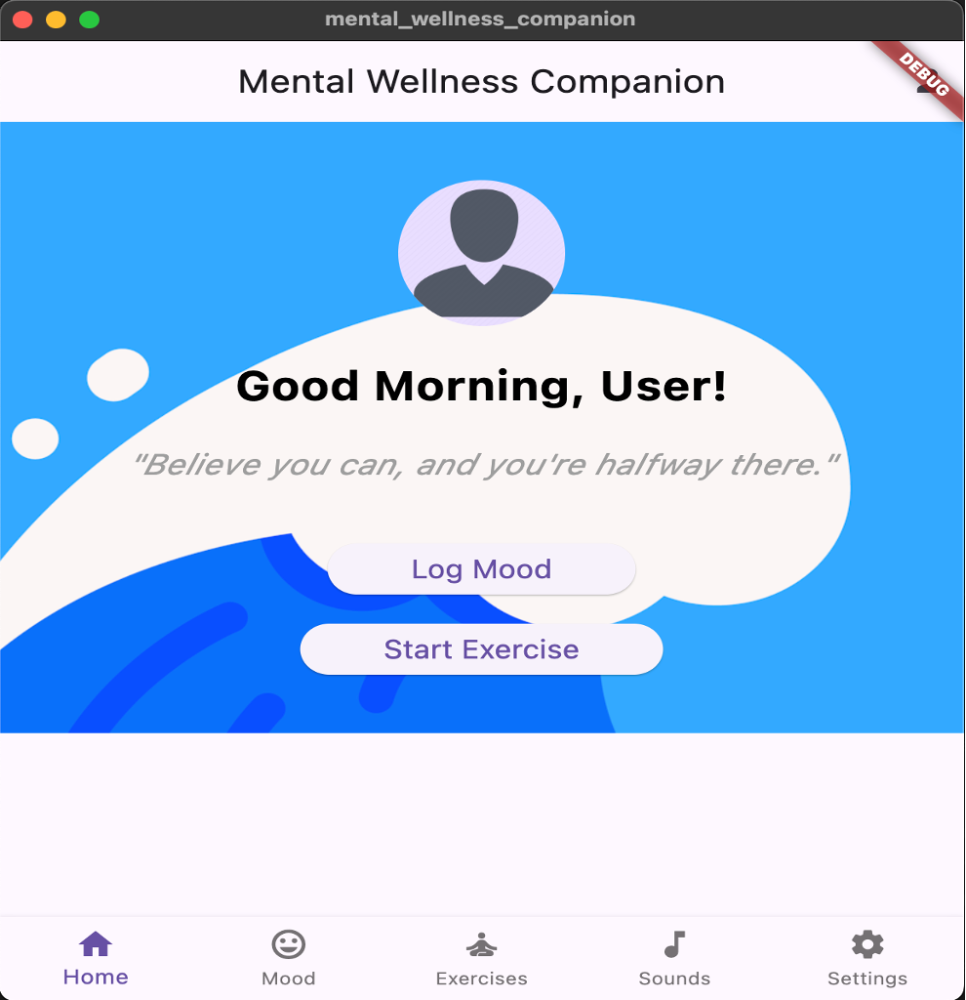
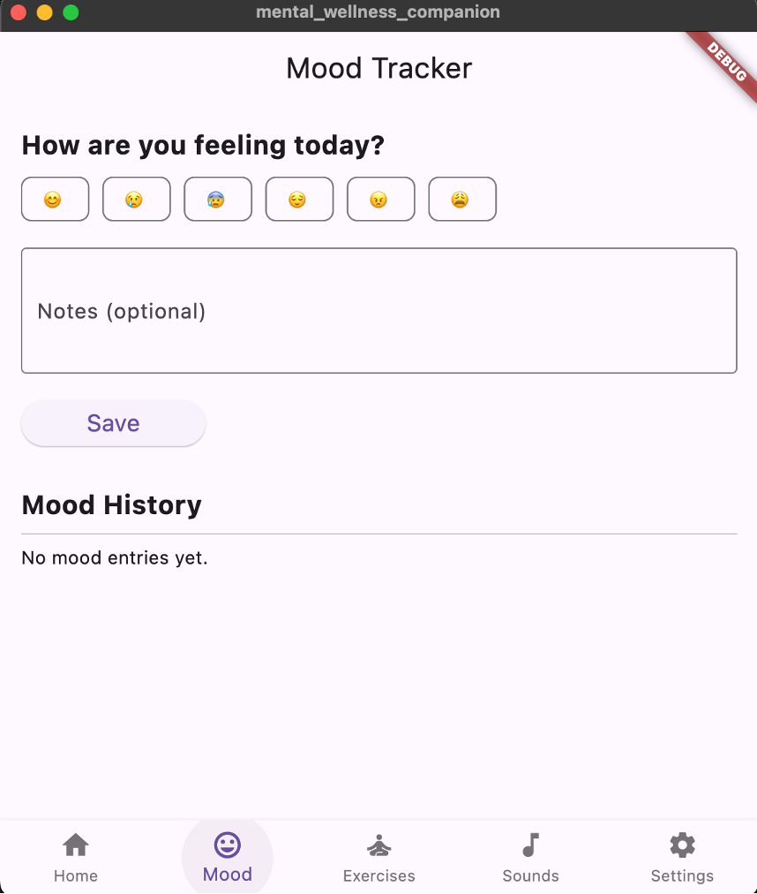
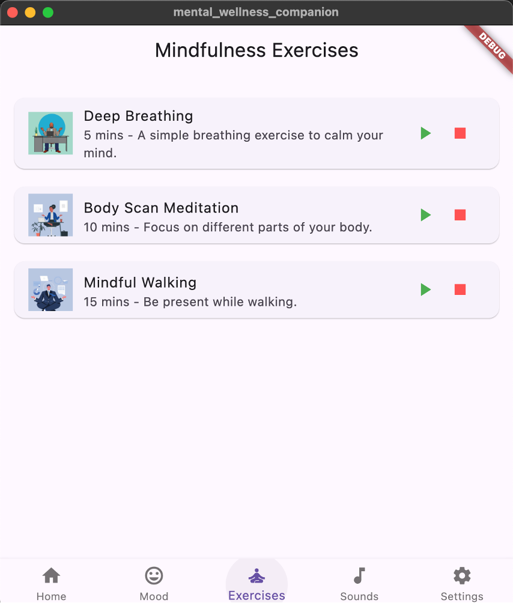
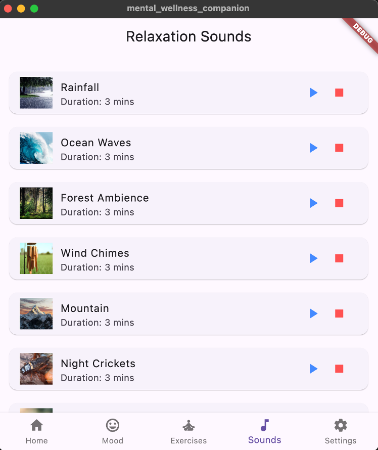
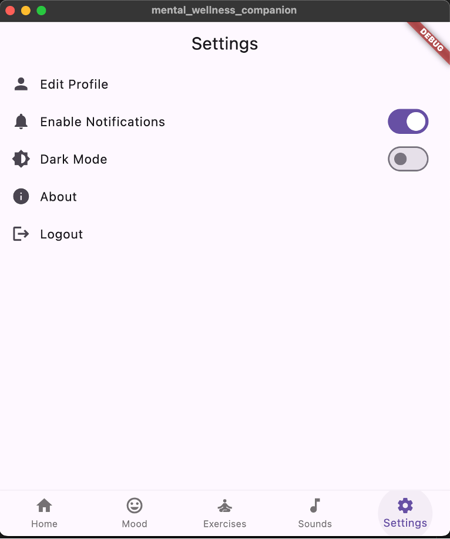

# Mental Wellness Companion App


A cross-platform mobile application built with **Flutter** and **Dart** to promote mental health and well-being. This app offers daily mindfulness exercises, a mood tracker with visual history, relaxation techniques, and customizable user settings.

<br/>

## Table of Contents
1. [Overview](#overview)  
2. [Key Features](#key-features)  
3. [Architecture & Tech Stack](#architecture--tech-stack)  
4. [Screenshots](#screenshots)  
5. [Getting Started](#getting-started)  
6. [Installation & Run](#installation--run)  
7. [How to Use](#how-to-use)  
8. [Roadmap & Future Improvements](#roadmap--future-improvements)  
9. [Contributing](#contributing)  
10. [License](#license)  

<br/>

## Overview
The **Mental Wellness Companion App** provides a convenient way for users to log their moods, practice mindfulness exercises, listen to relaxation sounds, and customize various app settings. By focusing on daily mental health habits and reflections, this app aims to help users cultivate a balanced emotional state.

<br/>

## Key Features
- **Mood Tracker**  
  Log and visualize your daily moods with optional intensity and notes.  
- **Mindfulness Exercises**  
  Access a library of guided meditations, breathing exercises, and body scan sessions.  
- **Relaxation Sounds**  
  Enjoy playlists of nature sounds, ambient music, and white noise for stress relief.  
- **Personalized Home Screen**  
  Receive motivational quotes and greetings based on the time of day.  
- **Settings & Customization**  
  Configure reminders, notification preferences, and toggle between light/dark themes.

<br/>

## Architecture & Tech Stack
- **Framework**: [Flutter](https://flutter.dev/)  
- **Language**: [Dart](https://dart.dev/)  
- **State Management**: `StatefulWidget` / basic setState management (could be extended with [provider], [bloc], or [riverpod])  
- **UI/UX**: [Material Design](https://material.io/design)  
- **Potential Data Persistence**: `shared_preferences` / local database (to be implemented)

```
project_root/
├── android/
├── ios/
├── lib/
│   ├── main.dart
│   ├── screens/
│   ├── widgets/
│   ├── services/
│   └── ...
├── assets/
│   └── images/
├── screenshots/
│   └── ... (place your .png or .jpg files here)
└── pubspec.yaml
```

<br/>

## Screenshots

Below are example sections showcasing how to embed images. Replace these placeholders with your actual screenshot file paths inside `./screenshots/` or wherever you store them.

### Home Screen


- **Greeting**: Personalized message based on time of day.  
- **Motivational Quote**: Displays a new uplifting quote daily.  
- **Quick Access Buttons**: Log Mood, Start Exercise.

### Mood Tracker


- **Mood Icons**: Tap on an emoticon to log mood quickly.  
- **Notes Field**: Add personal reflections or context.  
- **Mood History**: Visual graph of emotional trends.

### Mindfulness Exercises


- **Categories**: Meditation, Breathing, Body Scan.  
- **Thumbnails & Durations**: Easily select exercises.  
- **Play/Pause Controls**: Simple, intuitive interaction.

### Relaxation Sounds


- **Sound Categories**: Nature, Ambient, Instrumental, White Noise.  
- **Now Playing Bar**: Shows current track with playback controls.

### Settings Page


- **Notification Toggles**: Enable or disable reminders.  
- **Theme Preferences**: Switch between Light and Dark modes.  
- **Profile & Logout**: Placeholder for future implementation.

<br/>

## Getting Started
1. **Clone this repository**  
   ```bash
   git clone https://github.com/your-username/mental-wellness-companion.git
   ```
2. **Open in Visual Studio Code** (or your preferred IDE):  
   ```bash
   cd mental-wellness-companion
   code .
   ```
3. **Check Flutter & Dart Versions**  
   Ensure you have the correct environment setup:
   ```bash
   flutter --version
   dart --version
   ```
   *Recommended:* Flutter 3.0 or higher, Dart 2.17 or higher (adjust if needed).

<br/>

## Installation & Run

1. **Install Dependencies**  
   From the project root, run:
   ```bash
   flutter pub get
   ```
2. **Build & Run (Debug Mode)**  
   ```bash
   flutter run
   ```
   - For Android: Make sure an emulator/device is running.  
   - For iOS: An iOS simulator or an actual iPhone device should be connected.

3. **Build & Run (Release Mode)**  
   ```bash
   flutter build apk   # For Android
   flutter build ios   # For iOS
   ```

<br/>

## How to Use

1. **Home Screen**  
   - Greeted with personalized message and motivational quote.  
   - Tap **Log Mood** to quickly record how you feel.  
   - Tap **Start Exercise** to begin a mindfulness session.

2. **Logging Mood**  
   - Select an emoticon that reflects your mood.  
   - (Optional) Slide the intensity bar for more detail.  
   - (Optional) Add any notes or thoughts.  
   - Tap **Save** to store your mood entry.

3. **Mindfulness & Relaxation**  
   - Browse exercises under **Meditation** or **Breathing** categories.  
   - Listen to **Relaxation Sounds** like nature or ambient tracks.  
   - Use **Play/Pause** control to manage playback.

4. **Settings**  
   - Toggle notifications and set reminders for mood logging.  
   - Choose a **Light** or **Dark** theme.  
   - Profile & Logout sections are placeholders for future account management.

<br/>

## Roadmap & Future Improvements
- **User Authentication**: Secure login for personalized data sync.  
- **Advanced Analytics**: Enhanced mood history and correlation with daily activities.  
- **Notifications**: Timed push notifications for mood logging or exercise reminders.  
- **Expanded Exercises**: Additional meditation, yoga, or breathing techniques.  
- **Localization**: Support for multiple languages.

<br/>

## Contributing
Contributions are welcome! If you’d like to:
1. **Report Bugs**: Use [Issues](https://github.com/your-username/mental-wellness-companion/issues).  
2. **Suggest Features**: Open an Issue or submit a PR.  
3. **Make a Pull Request**:  
   - Fork the repo  
   - Create a branch  
   - Commit changes  
   - Open a pull request for review

<br/>

## License
[MIT License](./LICENSE)  
You are free to use, modify, and distribute this software under the terms of the MIT License.

<br/>

---
**Disclaimer**: This application is not a substitute for professional mental health care. If you or someone you know is experiencing a crisis, please seek professional help immediately.

---

**© 2024 [Talent Nyota]. All rights reserved.**  

Feel free to reach out with any questions or suggestions!

---
